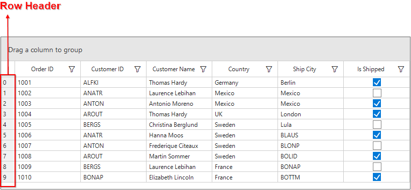
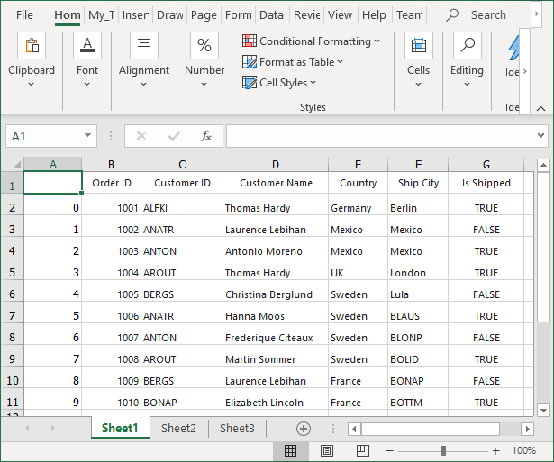

# How to export the WinForms DataGrid (SfDataGrid) with RowHeader?

## About the sample
This example illustrates how to export the WinForms DataGrid (SfDataGrid) with RowHeader

By default, [SfDataGrid](https://help.syncfusion.com/cr/cref_files/windowsforms/Syncfusion.SfDataGrid.WinForms~Syncfusion.WinForms.DataGrid.SfDataGrid.html)  does not provide the support to export the row header. You can export the row header column by using Worksheet.InsertColumn method to insert column manually in ExcelSheet and make customization in inserted column.

```C#
private void BtnExportExcel_Click(object sender, EventArgs e)
{
      var excelEngine = sfDataGrid.ExportToExcel(sfDataGrid.View, ExcelExportingOptions1());
      var workBook = excelEngine.Excel.Workbooks[0];

      IWorksheet sheet = workBook.Worksheets[0];

      sheet.InsertColumn(1, 1, ExcelInsertOptions.FormatDefault);
      var rowcount = this.sfDataGrid.RowCount;

      for (int i = 1; i < rowcount; i++)
      {
          sheet.Range["A" + (i + 1).ToString()].Number = (i - 1);
      }

      SaveFileDialog saveFilterDialog = new SaveFileDialog
      {
          FilterIndex = 2,
          Filter = "Excel 97 to 2003 Files(*.xls)|*.xls|Excel 2007 to 2010 Files(*.xlsx)|*.xlsx|Excel 2013 File(*.xlsx)|*.xlsx",
          FileName = "Sample1"
      };

      if (saveFilterDialog.ShowDialog() == System.Windows.Forms.DialogResult.OK)
      {
          using (Stream stream = saveFilterDialog.OpenFile())
          {
              if (saveFilterDialog.FilterIndex == 1)
                  workBook.Version = ExcelVersion.Excel97to2003;
              else if (saveFilterDialog.FilterIndex == 2)
                  workBook.Version = ExcelVersion.Excel2016;
              else
                  workBook.Version = ExcelVersion.Excel2013;
              workBook.SaveAs(stream);
          }

          //Message box confirmation to view the created workbook.
          if (MessageBox.Show(this.sfDataGrid, "Do you want to view the workbook?", "Workbook has been created",
                                  MessageBoxButtons.YesNo, MessageBoxIcon.Information) == DialogResult.Yes)
          {
              //Launching the Excel file using the default Application.[MS Excel Or Free ExcelViewer]
              System.Diagnostics.Process.Start(saveFilterDialog.FileName);
          }
      }
}

```

The following screenshot illustrates the SfDataGrid,



The following screenshot illustrates the SfDataGrid exporting to the Excel Sheet,



## Requirements to run the demo
Visual Studio 2015 and above versions

